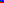
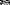
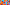

[](https://travis-ci.org/lxxxvi/mosaiq)

# Mosaiq

Mosaiq creates images with randomly colored pixels.

## Installation

Add this line to your application's Gemfile:

```ruby
gem 'mosaiq'
```

And then execute:

    $ bundle

Or install it yourself as:

    $ gem install mosaiq

## Usage

Base usage:

```ruby
mosaiq = Mosaiq::Image.new(width: 3, height: 4, colors: %w[red green blue])
```

* Unit of `width` and `height` is pixels
* `colors` is an `Array` of color names. Any valid HTML color will work. There are also predefined color "Palettes", [see below](#palette).


### SVG

Currently only SVG is supported.

```ruby
puts mosaiq.svg
# => <?xml version="1.0" encoding="UTF-8"?> ...
```

which looks like this when saved to a file

| Result                                                        |
|---------------------------------------------------------------|
|  |


## Palette

There are three predefined "Palettes" of colors:

| Palette            | Example                                                                              | Result                                                                  |
|--------------------|--------------------------------------------------------------------------------------|-------------------------------------------------------------------------|
| `black_and_white`  | `Mosaiq::Image.new(width: 10, height: 5, colors: Mosaiq::Palette::black_and_white)`  |  |
| `grays`            | `Mosaiq::Image.new(width: 10, height: 5, colors: Mosaiq::Palette::grays)`            |                      |
| `random_colors(n)` | `Mosaiq::Image.new(width: 10, height: 5, colors: Mosaiq::Palette::random_colors(8))` |    |


## Development

After checking out the repo, run `bin/setup` to install dependencies. Then, run `rake test` to run the tests. You can also run `bin/console` for an interactive prompt that will allow you to experiment.

To install this gem onto your local machine, run `bundle exec rake install`. To release a new version, update the version number in `version.rb`, and then run `bundle exec rake release`, which will create a git tag for the version, push git commits and tags, and push the `.gem` file to [rubygems.org](https://rubygems.org).

## Contributing

Bug reports and pull requests are welcome on GitHub at https://github.com/lxxxvi/mosaiq. This project is intended to be a safe, welcoming space for collaboration, and contributors are expected to adhere to the [Contributor Covenant](http://contributor-covenant.org) code of conduct.

## License

The gem is available as open source under the terms of the [MIT License](https://opensource.org/licenses/MIT).

## Code of Conduct

Everyone interacting in the Mosaiq project’s codebases, issue trackers, chat rooms and mailing lists is expected to follow the [code of conduct](https://github.com/[USERNAME]/mosaiq/blob/master/CODE_OF_CONDUCT.md).
